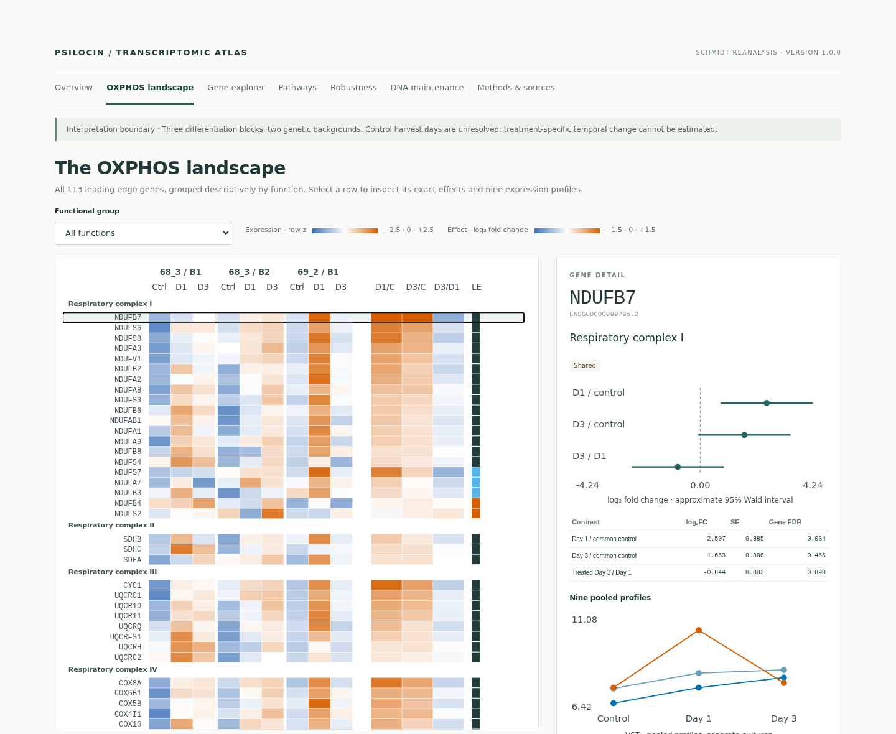

<h1 align="center">Metabolic and redox transcriptional signatures after brief psilocin exposure in human iPSC-derived cortical neurons</h1>

<p align="center">
  <em>A brief perturbation. A broad transcriptional signature.</em><br>
  Reproducibility code and interactive atlas
</p>

<p align="center">
  <strong>Independent secondary analysis of the public human iPSC-derived cortical-neuron RNA-seq dataset generated by Schmidt et al. (2026).</strong>
</p>

<p align="center">
  <a href="https://psilocybin-research.github.io/psilocin-human-neuron-transcriptomics/"><strong>Explore the live atlas</strong></a>
  ·
  <a href="https://doi.org/10.5281/zenodo.22849800">Archived release</a>
  ·
  <a href="#quick-start-in-r">R quick start</a>
  ·
  <a href="#citation">Citation</a>
</p>

<p align="center">
  <a href="https://github.com/psilocybin-research/psilocin-human-neuron-transcriptomics/actions/workflows/ci.yml"></a>
  <a href="https://doi.org/10.5281/zenodo.22849800"></a>
  <a href="LICENSE.md"></a>
</p>

The atlas is the fastest way to inspect the complete result. It exposes the pathway matrix, the 113-gene OXPHOS landscape, transcriptome-wide gene estimates, every frozen sensitivity analysis, bounded DNA-maintenance follow-up, downloadable CSV files, and exact provenance. The browser only selects and displays archived outputs; it does not refit models or create new tests.

## What this project provides

| Area | What is available |
| --- | --- |
| Interactive evidence | A public atlas with overview, gene, pathway, robustness, DNA-maintenance and methods views |
| Complete results | Gene-level estimates, pathway tables, leading edges, sensitivity variants and null/untestable results |
| Reproducibility | Frozen plans, executable Python/R code, locked environments, checksums and session information |
| Scientific context | Explicit experimental units, multiplicity families, temporal limits and interpretation boundaries |
| Persistent archive | Versioned Zenodo software record with a checksum-verified release archive |

## Main result

A brief psilocin perturbation was associated with a broad OXPHOS-centered transcriptional signature at both later sampling points. The signal was distributed across 95 and 107 leading-edge genes, with 89 shared, and retained its direction across the prespecified block and RNA-quality checks.

That distributed and reproducibly characterized OXPHOS response is the principal finding of this secondary analysis. A separately specified post-primary tier did not support NRF2, glutathione, or their joint NRF2–glutathione–pentose-phosphate prediction as the specific mechanism. This narrows the mechanistic interpretation; it does not convert the broader OXPHOS-centered finding into a null result.

The frozen exploratory family also identified positive DNA-repair and telomere-maintenance enrichment at both sampled days. In the separately corrected post hoc decomposition, DNA repair remained supported after telomere-set genes were removed, whereas telomere maintenance after removal of DNA-repair genes met the follow-up threshold only at Day 1. Accompanying DNA-replication enrichment and mixed cell-cycle controls leave biological specificity unresolved. These findings nominate an exploratory genome-maintenance-associated transcriptional dimension; they do not establish DNA-repair activity, telomere maintenance, or a nonspecific proliferative response.

Source materials describe vehicle controls at matching time points, but the public RNA-seq metadata do not link individual control libraries to harvest day. This reanalysis therefore uses the available common control pool and cannot estimate a treatment × time interaction. Competitive pathway q-values describe concentration within the ranked transcriptome, not biological-replication probabilities across three differentiation blocks. Transcriptomic enrichment does not establish respiration, ATP production, redox flux, DNA-repair activity or telomere preservation. Psilocin is the active metabolite of psilocybin; the cell experiment analyzed here used **psilocin**, and this repository preserves that distinction.

<p align="center">
  <a href="https://psilocybin-research.github.io/psilocin-human-neuron-transcriptomics/#view=landscape">
    
  </a>
</p>

## Start with the atlas

Open the **[live interactive atlas](https://psilocybin-research.github.io/psilocin-human-neuron-transcriptomics/)**. Useful entry points include:

- [Overview and complete primary pathway matrix](https://psilocybin-research.github.io/psilocin-human-neuron-transcriptomics/#view=overview)
- [113-gene OXPHOS landscape](https://psilocybin-research.github.io/psilocin-human-neuron-transcriptomics/#view=landscape)
- [Searchable gene explorer](https://psilocybin-research.github.io/psilocin-human-neuron-transcriptomics/#view=genes)
- [All pathway tiers and contrasts](https://psilocybin-research.github.io/psilocin-human-neuron-transcriptomics/#view=pathways)
- [Prespecified robustness checks](https://psilocybin-research.github.io/psilocin-human-neuron-transcriptomics/#view=robustness)
- [Bounded DNA-maintenance follow-up](https://psilocybin-research.github.io/psilocin-human-neuron-transcriptomics/#view=dna)
- [Methods, sources and checksums](https://psilocybin-research.github.io/psilocin-human-neuron-transcriptomics/#view=methods)

The release also retains a frozen static atlas under [`site/`](site/).

## Quick start in R

The complete derived tables are public, so readers can inspect the primary results without downloading raw RNA-seq inputs or rebuilding the analysis.

**[Run this quick start on GitHub →](https://github.com/psilocybin-research/psilocin-human-neuron-transcriptomics/actions/workflows/reproduce-r.yml)**

The manual workflow runs [`src/quick_start.R`](src/quick_start.R) with R 4.6.1, presents the key results in the GitHub run summary, and provides the reproduced CSV tables plus complete R session information as a downloadable artifact. It uses base R and the repository's frozen derived tables; the locked environments remain available for full analytical reproduction.

```r
base <- paste0(
  "https://raw.githubusercontent.com/psilocybin-research/",
  "psilocin-human-neuron-transcriptomics/v1.0.1/"
)

enrichment <- read.csv(paste0(
  base,
  "tables/transcriptomics/enrichment_primary_model.csv"
))

primary <- subset(
  enrichment,
  tier == "primary" & variant == "primary"
)

primary[c(
  "pathway", "contrast", "NES", "family_fdr", "robustness"
)]

oxphos <- subset(
  primary,
  pathway == "HALLMARK_OXIDATIVE_PHOSPHORYLATION"
)
oxphos[c("contrast", "NES", "family_fdr", "robustness")]
```

To inspect transcriptome-wide Day-1 gene estimates:

```r
day1 <- read.csv(paste0(
  base,
  "tables/transcriptomics/primary_day1_vs_control_genes.csv"
))

day1[day1$symbol %in% c("GPX4", "NDUFB7", "ATP5A1"),
     c("gene_id", "symbol", "log2FoldChange", "pvalue", "padj")]
```

These are derived results from the archived analysis. Gene-level adjusted p-values remain transcriptome-wide estimates and are not independent confirmation of pathway enrichment.

## Source study

This repository is an independent secondary analysis and derived research object. It is not the original experimental dataset or the original Schmidt/Hoffrichter analysis.

The original experiment and data generation were reported in:

> Schmidt M, Hoffrichter A, Davoudi M, Horschitz S, Lau T, Meinhardt MW, Spanagel R, Ladewig J, Köhr G, Koch P. (2026). Psilocin fosters neuroplasticity in iPSC-derived human cortical neurons. *eLife*, 14, RP104006. [https://doi.org/10.7554/eLife.104006](https://doi.org/10.7554/eLife.104006)

- [Original Schmidt article](https://doi.org/10.7554/eLife.104006) (the reviewed version used here is [eLife.104006.3](https://doi.org/10.7554/eLife.104006.3))
- [Associated Schmidt Dryad research data](https://doi.org/10.5061/dryad.xsj3tx9w3), distributed under Dryad's CC0 framework
- Original Hoffrichter/Schmidt RNA-seq analysis code: [pinned Git commit](https://github.com/ahoffrichter/Schmidt_et_al_2025/tree/c565709affafbea09406bd7b42fe494f08db6cce) and preserved Software Heritage directory [`swh:1:dir:c847a8a51074c59d651e3258cf1355936e921048`](https://archive.softwareheritage.org/swh:1:dir:c847a8a51074c59d651e3258cf1355936e921048/)

Christopher B. Germann performed this secondary analysis and created its reproducibility code, specifications, derived tables, figures, tests, and interactive atlas. Schmidt et al. are cited and attributed as the source-study authors, but are not listed as creators of this research object. Raw source files are not duplicated here. [`metadata/provenance.json`](metadata/provenance.json) records pinned source URLs, versions and SHA-256 checksums; acquisition scripts restore and verify public inputs. Cite the original Schmidt article when using or discussing the source experiment, and cite this archived release when using this reanalysis, atlas, code, or derived results. Newly created materials and upstream sources retain the path-level licenses documented in [`LICENSE.md`](LICENSE.md), [`FILE_LICENSES.json`](FILE_LICENSES.json), and [`THIRD_PARTY_NOTICES.md`](THIRD_PARTY_NOTICES.md).

## Reproduce the analysis

The analysis used Python 3.10 and R 4.6.1. Exact package states are recorded in `requirements.lock.txt`, `renv.lock` and `renv.figures.lock`.

```bash
git clone https://github.com/psilocybin-research/psilocin-human-neuron-transcriptomics.git
cd psilocin-human-neuron-transcriptomics

python3 -m venv .venv
.venv/bin/python -m pip install -r requirements.lock.txt
.venv/bin/python -m pip install -r requirements.release.txt
make acquire
make audit
make audit-design
make test
make setup-r
make qc-reproduce
make analyze
make targeted-redox
make dna-maintenance
make oxphos-alias-sensitivity
make figures
```

Network acquisition is explicit. Analysis and reporting commands use checksum-verified inputs and frozen specifications. To build the atlas locally:

```bash
npm --prefix explorer ci
npm --prefix explorer test
npm --prefix explorer run build
python3 -m http.server 4173 --directory explorer/dist
```

Then open `http://127.0.0.1:4173/`.

## Repository guide

| Path | Contents |
| --- | --- |
| [`src/`](src/) | Acquisition, audit, RNA-seq, enrichment and figure code |
| [`config/`](config/) | Frozen model, pathway and sensitivity specifications |
| [`metadata/`](metadata/) | Sample mappings, source inventory and design audit |
| [`tables/`](tables/) | Complete derived gene, pathway and sensitivity results |
| [`figures/`](figures/) | Publication figures and QC summaries in reusable formats |
| [`explorer/`](explorer/) | Atlas source, tests and frozen display data |
| [`site/`](site/) | Frozen static atlas build |
| [`reports/`](reports/) | Frozen plan and complete scientific result reports |
| [`docs/`](docs/) | Public analysis chronology and README images |
| [`provenance/`](provenance/) | Freeze records, session information and checksums |

## Statistical scope

The primary model conservatively aggregates raw counts from 23 libraries into nine condition profiles across three differentiation blocks and two genetic backgrounds. Competitive pathway p-values describe concentration within ranked genes; they are not biological-replicate p-values. “Robust” denotes the frozen within-dataset directional criterion in [`reports/analysis_plan_frozen.md`](reports/analysis_plan_frozen.md).

Exploratory DNA-repair and telomere-maintenance findings and their post hoc decomposition are clearly separated from the primary metabolic and redox analysis. See [`docs/analysis_history.md`](docs/analysis_history.md).

## Citation

Use GitHub’s **Cite this repository** control or [`CITATION.cff`](CITATION.cff). The permanent citation for this release is:

> Germann, C. B. (2026). *A brief perturbation. A broad transcriptional signature: psilocin human-neuron transcriptomics* (Version 1.0.1) [Computer software]. Zenodo. [https://doi.org/10.5281/zenodo.22849800](https://doi.org/10.5281/zenodo.22849800)

## Data availability

Source RNA-seq data are available from the [Schmidt author repository](https://github.com/ahoffrichter/Schmidt_et_al_2025) and associated [Dryad record](https://doi.org/10.5061/dryad.xsj3tx9w3). Raw source files are not redistributed; acquisition scripts restore and checksum-verify the pinned public inputs.

## Code availability

Code, frozen specifications, derived results, and the static atlas are archived as [Zenodo version 1.0.1](https://doi.org/10.5281/zenodo.22849800); the maintained source is on [GitHub](https://github.com/psilocybin-research/psilocin-human-neuron-transcriptomics).

Version 1.0.1 contains documentation and interpretation clarifications; analytical results are unchanged from version 1.0.0.

## Contact

Christopher B. Germann, Faculty of Health, School of Medicine, University of Witten/Herdecke · [ORCID 0000-0002-1573-4651](https://orcid.org/0000-0002-1573-4651) · [Christopher.Germann@uni-wh.de](mailto:Christopher.Germann@uni-wh.de)

## Integrity and licensing

`make validate-release` checks the curated package; `SHA256SUMS` and `PUBLICATION_MANIFEST.json` describe the archived tree.

Original software is MIT licensed. Original documentation, figures and derived result tables are CC BY 4.0; upstream components retain their original terms. See [`LICENSE.md`](LICENSE.md), [`FILE_LICENSES.json`](FILE_LICENSES.json), [`THIRD_PARTY_NOTICES.md`](THIRD_PARTY_NOTICES.md) and [`metadata/gene_set_redistribution_review.json`](metadata/gene_set_redistribution_review.json).
